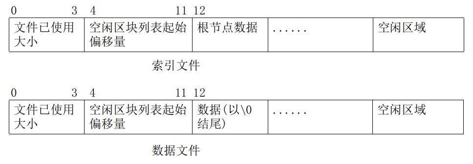
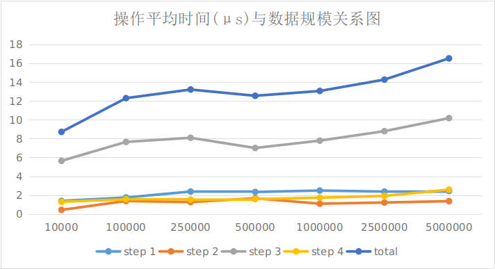

# 简易数据库设计文档
515110910029 王自铭 
***

[TOC]

***

##  基本信息介绍

### 环境介绍

- 运行平台: Linux x86-64 (在 Windows 下无法运行)
- 测试配置:
  - CPU:  Intel(R) Core(TM) i7-4720HQ CPU @ 2.60GHz
  - 内存: 8G
  - 硬盘: 7200 rpm

### 使用方法

- 编译并运行命令行交互式程序: `make clean && make database && ./database`
- 编译并运行正确性测试程序: `make clean && make validity && ./validity`
- 编译并运行性能测试程序: `make clean && make performance && ./performance`
- 在其他程序中使用: `make clean && make archive`编译生成静态库`database.a`, 在其他程序中使用`database.h`中的接口, 并链接该静态库即可

### 注意事项

- 初始化时提供的索引文件和数据文件都不存在时, 将初始化一个新的数据库; 如果索引文件和数据文件仅有一个不存在时, 将报错; 如果都存在, 则打开提供的数据库, 但是如果这两个文件不是由本程序生成, 将产生不可预知的后果(Segmentation Fault, 产生一个4 GB的文件等).

## 接口介绍

接口提供 `<const char*, const char *>` 的形式, 其中`key`为定长的字符串, `value`为不定长字符串. `key`的最大长度可以在编译时配置; `value`也可以扩展为其他带有结束标志位, 或定长的其他类型数据(具体请看下文分析). 具体接口如下:

- `Database(const char *index, const char *data)`(构造函数): 

  使用提供的索引文件名与数据文件名初始化数据库, 索引文件和数据文件都不存在时, 将初始化一个新的数据库; 如果索引文件和数据文件仅有一个不存在时, 将报错; 如果都存在, 则打开提供的数据库, 但是如果这两个文件不是由本程序生成, 将产生不可预知的后果(Segmentation Fault, 产生一个4 GB的文件等).

- `~Database()`(析构函数):

  关闭数据库,并释放内存

- `bool store(const char *key, const char *value)`

  存储提供的`key`与`value`, 若存储成功, 则返回`true`, 若该`key`已经存在, 则返回`false`

- `char *fetch(const char *key)`

  根据提供的`key`查找`value`, 若查找成功, 则返回字符串指针(需要在数据库的生命周期中使用, 否则则关闭数据库时该内存区域将被释放, 调用会引起段错误); 否则返回`NULL`

- `bool modify(const char *key, const char *value)`

  将指定记录的值修改为新的值, 如果记录不存在, 则返回`false`, 如果记录存在, 则修改记录, 并返回`true`

- `bool remove(const char *key)`

  删除指定记录, 若记录存在, 则删除并返回`true`, 否则返回`false`

- `void rewind()`

  将游标初始化, 即移动到第一条记录的位置

- `char *nextrec(char *key)`

  返回游标所在的记录, 其中传入的`key`接收记录的`key`, 返回值为记录的`value`, 并将游标后移一位. 若游标达到记录的末尾, 则返回`NULL`, 不修改`key`的值

  ​

## 内部模块与目录结构

### 数据结构

本数据库采用B+树索引, 相关文件均在`dataStructure`目录下. 其中`b+tree.h`中包含了B+树节点`TreeNode`的定义和B+树`BPlusTree`的定义, 而`b+tree.cpp`包含了它们的实现

### 持久化及空间管理

本数据库采用`mmap`的方式进行内存与文件的映射,从而实现数据的持久化. 相关文件均在`manage`目录下. 其中`file.h`中定义的`FileManage`提供了打开文件,扩容文件,获取映射地址,取消映射,关闭文件等与文件和映射相关的操作; `blockManage.h`中定义的`BlockManage`提供了对一块内存空间的分配, 回收, 地址-偏移量转换的操作

### 整合

数据库的主体文件在`main`目录下, 其中`database.h`中定义了数据库的接口,在上文中已经介绍过, `main.cpp`中为使用数据库的交互式程序

### 测试

测试文件在`test`目录下, 其中`validity.cpp`为正确性测试, 如果运行时没有抛出异常, 则表明测试成功; `performance.cpp`为性能测试, 运行后会打印运行的耗时

### 其他

在根目录下还有`Makefile`, 用于编译该数据库或静态库

## 实现细节

### B+树

B+树的`key` 为定长字符串, `value` 为`long`. 

考虑到文件每次映射的位置不同, 因此`value` 为该记录在数据文件中的偏移量, 而非叶节点中记录的子树的位置也是在索引文件中的偏移量. `BlockManage`可以将偏移量转换为绝对地址, 从而进行内存访问; 新建节点时也需要向`BlockManage`申请空间. 关于`BlockManage`的详细信息会在下文中叙述

由于在数据库中通常是要打开已存在的数据文件,故B+树也需要能够恢复一棵之前保存的B+树, 此处采用的方法为初始化时注入已有的根节点, 而根节点在文件中的位置是固定的(见下文).

关于B+树的其他实现细节与课堂介绍大同小异,此处不再多做介绍.

### 索引与数据文件的结构

索引与数据的文件结构如下:

由于扩充文件大小的代价较大(见下文), 文件末尾处总是会留有一些空闲区域,从而减少分配空间时文件扩容的次数. 因此需要在文件中记录已使用的空间的大小(即空闲区域开始的位置). 

在空闲区域被回收时, 会组织成空闲区块链表(见下文), 在文件开始处中会记录空闲链表起始位置. 

由于在初始化B+树时B+树的根节点的位置必须是已知的, 因此在索引文件中接下来存放根节点, 在数据文件中则直接记录数据.

### 文件的映射与扩容

此处采用`mmap`函数进行内存与硬盘的映射.因此内存空间以页为单位由操作系统管理,降低了实现的复杂性

由于`mmap`不支持扩充文件大小, 因此需要采用其他方式扩充文件.此处采用`lseek`函数在需要扩充到的位置处写入任意内容, 即可扩充文件大小. 在文件大小扩充后需要重新使用`mmap`函数映射.重新映射后需要更新B+树中记录的根节点地址, 并且此前加载的页全部失效, 造成大量的page fault. 因此需要采用适当的扩充策略, 在空间利用率与扩充次数之间平衡.(在性能测试中会进行讨论)

### 空间分配与回收

当没有已经回收的空闲区域时, 直接从空闲区域中分配(若空闲区域空间不足,则触发文件扩容); 若存在回收的空闲区域, 则从空闲区域中取出一块来分配. 由于取出的大小是可变的, 因此数据库可以扩展为支持各种定长的, 或带有结束标记的可变长度的`value`

回收空闲块时, 将空闲块组织成链表: 在空闲块中记录下一块空闲块的偏移量(若没有下一块空闲块,则填入-1), 并在文件开始处记录表头的位置. 新回收的空闲块总是添加到空闲链表的起始位置, 从而刚回收的空闲块总是先分配出去, 满足空间局部性原理.

空间回收仅在索引文件中实现. 这是因为索引文件中节点的大小通常足够大, 而且是定长的. 相比而言, 数据文件中存储的字符串本身长度较短, 且不定长, 经常出现回收空间的大小小于记录空闲链表需要的空间的现象, 因此在数据文件中实现相对困难. 

## 测试

### 正确性测试

#### 操作结果正确性

- 数据存储,读取与持久化
  - 测试目标: 检测数据库是否能正确地存储和持久化写入的数据
  - 测试方法: 向数据库中写入100000条随机生成的数据,并关闭数据库. 再次打开数据库, 读取这些记录, 并且比较`value`的值是否正确
  - 测试结果: 正确
- 数据修改
  - 测试目标: 检测数据库能否正确修改已有的数据
  - 测试方法: 修改上述100000条记录的`value`, 并关闭数据库. 再次打开数据库, 读取这些记录,比较是否成功地修改了`value`
  - 测试结果: 正确
- 数据删除
  - 测试目标: 检测数据库是否能正确删除记录, 删除后的记录能否被读取,修改, 删除不存在的数据时返回值是否正确
  - 测试方法: 删除上述100000条数据, 并关闭数据库. 再次打开数据库, 尝试读取,修改,删除这些记录
  - 测试结果: 正确
- 数据顺序访问与删除
  - 测试目标: 检测顺序访问数据时对数据进行删除是否会引发错误
  - 测试方法: 顺序访问并删除所有数据
  - 测试结果: 正确

#### 内存泄漏测试

- 测试目标: 检查是否有未回收的内存
- 测试方法: 进行大规模数据操作(100000+)后, 观察进程的内存占用情况
- 测试结果: 没有内存泄露

#### 文件泄露测试

- 测试目标: 检查数据库是否有打开但没有关闭的文件
- 测试方法: 在正确性测试末尾打开一个文件, 如果文件描述符为3, 则说明没有文件泄露
- 测试结果: 没有文件泄露

### 性能测试

注: 测试流程按照大作业讲解ppt中的流程进行

#### 不同数据量的存储效率

- 测试目标: 考察在不同数据规模下, 数据库的运行效率的变化

- 测试方法: 改变测试数据量, 运行性能测试程序

- 测试结果: 每个步骤时间对数据量的平均与数据量的关系如下图所示

  

- 结果分析:

  可以发现操作平均时间随着数据规模的增加, 非常缓慢地增加. 

  特别地, step 2的平均时间在数据规模增加时, 没有明显变化, 这表明B+树索引能够保证在数据规模增大时, 搜索的速度几乎不变.

  上述结果表明, 数据库在数据规模增加时操作速度变化不大, 具有良好的可扩展性 

#### 空间回收对减少文件大小的作用

- 测试目标: 考察空间回收对减少索引文件大小的作用

- 测试方法: 在启用空间回收和禁用空间回收的情况下, 多次运行性能测试程序, 观察文件大小的变化

- 测试结果: (单位: MB, nrec: 100000)

  | 运行次数   | 1    | 2    | 3    | 4    | 5    | 6    | 7    | 8    |
  | ------ | ---- | :--- | ---- | ---- | ---- | ---- | ---- | ---- |
  | 启用空间回收 | 8.4  | 8.4  | 8.4  | 8.4  | 8.4  | 8.4  | 8.4  | 8.4  |
  | 禁用空间回收 | 8.4  | 16.8 | 16.8 | 16.8 | 16.8 | 33.6 | 33.6 | 33.6 |

- 结果分析:可以发现, 在禁用空间回收时, 随着运行次数的增加, 文件大小逐渐增加; 而启用空间回收后,随着运行次数增加, 文件大小保持不变. 这说明在有大量的删除操作时, 空间回收可以有效减少索引文件的大小.

#### 扩容策略对存储效率的影响

- 测试目标: 考察一个不合适的扩容策略对存储效率的影响

- 测试方法: 分别使用简单扩容策略(每次扩容固定大小)和倍增扩容策略(每次扩容将文件大小翻倍), 运行性能测试程序, 比较存储(Step 1)效率

- 测试结果:(nrec: 1000000)

  |                 | 简单扩容策略  | 倍增扩容策略  |
  | --------------- | ------- | ------- |
  | Step 1 运行时间(ms) | 13253.6 | 2681.74 |
  | 文件大小(MB)        | 61.2    | 67.1    |

- 结果分析: 相对于倍增扩容策略而言, 简单扩容策略大大增加了平均插入记录的时间, 但在一定程度下减少了索引文件的大小. 而倍增扩容策略能够减少插入时间, 代价是增大了文件大小(至多2倍). 另一方面, 简单扩容策略通常需要依据数据规模配置扩容大小, 而倍增扩容策略可以适应各种数据规模

## 待改进

- 索引文件无法随着数据量的减少而收缩, 只能将空闲区块加入空闲链表
- 数据文件没有实现空间回收
- 没有尝试在B+树中配置更多的节点数

